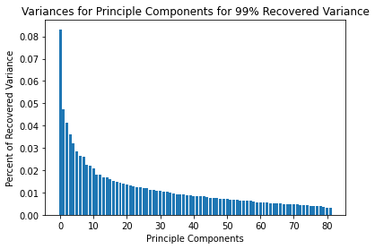

# Recognizing Misinformation

This project aims to analyze current models and technologies for recognizing and flagging misinformation on the internet, and hopes to improve these models and find patterns that people could use to make more informed decisions while reading news that could potentially be misinformation. Below are the single slides from Touchpoints.

## Introduction

While the spread of misinformation is not a new concept, the topic has recently garnered attention due to its relevance in the age of the Internet and social media. The increasingly concerning issue has been the subject of studies, especially in relation to vaccination, the Zika virus, as well as Ebola (Wang et al., 2019). More recently, most people in the world have been exposed to misleading news articles about COVID-19 in the past few months. This causes fear, uncertainty, and doubt that has had negative effects such as loss of life, economic instability, and political turmoil. To address this problem, we are designing a machine mearning model that can identify misinformation and warn the reader when they encounter a headline or article that may contain misinformation. While we are categorically focusing on coronavirus news right now, this model may be generalized to detect misleading and false news about other topics as well.

False or misleading news headlines can sometimes be characterized by errors in punctuation and spelling, use of exclamation marks, or use of all caps text. The credibility of verious news sources, tweets, whatsapp forwards, facebook posts, and online news websites can also be used as factors in determinging the presence of misinformation. We trained our models to identify these patterns that may correlate with misleading headlines or text.

## Methods
We are using a labeled dataset with the columns consisting of title of an article, the text body and whether it is true or misleading. [Here](https://raw.githubusercontent.com/susanli2016/NLP-with-Python/master/data/corona_fake.csv) is the link to our dataset.

### Data Preprocessing

The columns of our dataset are source, title text, body text, and label.

Some rows had ``NaN`` values for either the title or body. We replaced these with empty strings. We also grouped sources as "Facebook/Twitter/Youtube", "Medical", "Government", "Education", "News" and "Others" in order to understand the sentence construction in context of the sources (and their group of readers) and how it affects our clustering algorithms. We also cleaned the data to convert the labels column into a boolean "true" and "false" one.

Recognizing misinformation is a classification problem (and not regression) and our dataset consists of 1164 columns (or data points), and our class distribution consists of 584 (or 50.17%) articles that were labeled true and the rest (49.8%) were false. All of the articles were related to coronavirus.

This dataset is a collections of sentences so it does not contain any outliers and includes a diverse set of sources. Our feature engineering did lead to creation of some outliers when it came to misspellings and TF-IDF (discussed below) values, but we normalized all of the values before further analysis and also computed the PCA to highlight the important features.

### Feature Engineering

A significant step in processing our data is extracting numerical features we can use in supervised and unsupervised methods. One set of featues we will be using is the term frequency–inverse document frequency, a statistic commonly used for text classification (Peng et al., 2014). We are also generating our own features based on our intuition on potientially related properties of the text such as sentence structure or punctuation usage. 

Based on our features, the model will output whether a particular piece of news is trustable or not. Thus, our model is a binary classifier. To acheive this we are using unsupervised learning methods such as k-means clustering or other clustering algorithms and supervised learning methods such as logistic regression, decision trees, or neural networks (Ko & Seo, 2000).

These features will be normalized to text length where applicable. We also generated a heatmap of the correlation matrix to allow us to see which features (we reduced the number of features to 88 important ones for generating this graph) might be useful for clustering.

#### TF-IDF

Text frequency-inverse document frequency measures the importance of a word to a document within a corpus. We hypothesized that a text with and wihtout misinformation may be characterized by the emphasis of certain words. We chose to limit the minimum docment frequency to .2 in an attempt to filter out words that are too rare to effectively catagorize an article to be misinformation.

#### Stylistic and Vocabulary Patterns

Studies have shown fake news may use simpler, repetitive content in the text body, and more proper nouns and verbs in their titles. Horne & Adali's study on fake news uncovers these characteristics, and many others on which we based our feature engineering (2017).

We extracted the following vocabulary and style statistics:
Type-Token Ratio,
Flesh-Kincaid Grade Readability Index,
Gunning Fog Grade Readability Index,
stop-words,
pronouns, 
adjectives,
negations,
capital letters,
average word length, number of quotes, etc.

We also extracted other ad hoc features such as sentiment (which is comprised of polarity and subjectivity), and mispellings.

#### Source

The reliability of the information within an article may be highly correlated to the source where the article was found. We labelled articles by source with one hot encoding into categories like government, social media, academia, mainstream news, or other.

### Feature Selection

As an initial step to reduce dimensionality after feature engineering, we utilized the filter method with correlation to eliminate irrelevant features. The following is the correlation matrix of the stylistic patterns features, with an additional column representing the correlation of each feature to the label. Using a cut-off of 0.5 for the p-value, we discovered that the frequency of proper nouns and capital letters were corrlated (p = 0.71), and we eliminated the proper nouns feature because it was less correlated with the label (p = 3.9e-38 vs. p = 5.4e-0.7).

This is the correlation matrix of the TFIDF features, with an additional column representing the correlation of each feature to the label. The feature for the word "covid" was highly correlated with the one for "19" (p = 0.99), and we eliminated 'tfidf_19'.

## Unsupervised Learning

### Dimensionality Reduction
TFIDF returns 76 features. Additional feature engineering provided 12 features. We used PCA to experiment with the effects of dimensionality reduction.

First we used PCA to recover 99% of varience on all the normalized data. This only reduced the dimensions to 82 from a feature count of 88 which shows that most of our features are not extraneous.

We then also used PCA to produce 20 components. The first principal compoent is dominant due to one of the non tf-idf features. This was conlcuded through comparing PCA of just the features with tf-idf and without tf-idf added features.

### Clustering

We normalized our features and ran DBScan, K-means and GMM on the all of the features. The graphs are plotted against the two features of sentiment analysis, polarity and subjectivity. Polarity is a value between 0 and 1 that indicates whether the text is negative or positive, and subjectivity is a value between 0 and 1 that indicates whether the text is a fact or personal opinion.

DBScan clusters data based on their distances, and this distance is calculated using the vectors (of features) that we generated. We normalized all of our features so that none of them dominates over the others. We used this algorithm as it clusters based on "closeness" to neighboring vectors, and if DBScan returns two clusters with high purity then this means that true and misleading articles are distinct. DBScan returned three clusters instead of two because we couldn't manually choose the number of clusters, but it gave us important insight into the fact that even within the same label, our datapoints have a lot of variety.

K-means clusters data using randomly selected centroids (or for sci-kit learn it tries to optimize convergence), and then clusters vectors close to that center into one cluster. We used two number of clusters, and the F1 score of K-mean was significantly higher than DBScan. The results showed that it is possible that a misleading article might closely resemble true ones, and vice versa.

GMM uses expectation-maximization to cluster data. We used this method as DBScan and K-means showed the weakness in using just distance to cluster our data, and the results we got were better than K-means with a higher F-score. This means that distance is not the right way to approach the problem of clustering misinformation, and we should rather focus on algorithms that use EM or other probabilitistic methods.

When we looked at how all three of our clustring algorithms were clustering data when it came to sources, we found that it often clustered false news articles and the true articles from government and educational sources together, and this means that false news articles often portray themselves as being official or gain credibility by using a writing style similar to educational sources. 

### F-measure:

After obtaining two labelled clusters from each of the three clustering algorithms, the F1 score metrics from sci-kit learn was ran on these predictive labels and the true labels from our dataset. The results are shown in the bar graph below:

F1 score, otherwise known as F-measure, is the average between precision and recall, which is why it was chosen as measurement of performance. In this case, precision is the number of correctly identified true news articles, divided by the number of articles classified as true. On the other hand, recall is the number of correctly identified true news articles, divided by the number of true articles. GMM and K-Means both had an F-Measure well above 0.50 (0.82 and 0.65), and this can serve as an indication that there is some feature(s) in our dataset that can used to differentiate between false and true news articles.

### Conclusion

After running the clustering algorithms as described above, we realized that our data isn't very suitable to unsupervised learning as it does not learn from "experience" and that is an important factor in our data because of how subjective the labels can be. Supervised learning is general is known to incraese accuracy, F-scores, etc., and improving the F-score is one of our main goals right now.

## Supervised Learning

### Decision Tree
We used Decision Tree on a non-PCA dataset to retain the order of column labels in order to understand what feature(s) are the most important ones in differentiating between true and misleading articles. The first step was calculating an optimal depth, which came out to 8, and the plot for accuracy v. depth is below. 

Then we visualized the decision tree with depth 8 and we found out that proper nouns, adjective and misspellings are more frequent in misleading articles.

### Random Forest
To improve on the performance of decision trees, we turned to a random forest classifier. We scanned through a range for the number of trees and max depth to determine the optimal hyperparameters. Training and testing data was split randomly with 33% of the data set aside for the test phase. The average accuracy of ten runs per hyperparameter pair was recorded.

An optimal accuracy of 86.83% was reached with a max depth of 10 and 1500 estimators. The limitation of the random forest classifier was the time to train and test many trials with many estimators. We saw minor increase in performance with more estimators but the amount of increase did not warrant the increasingly longer time it took to train. 

### Multi-Layer Perceptron

We used Sci-kit Learn's multi-layer perceptron which is a two-layer neural network that uses backpropagation. Since our dataset wasn't very big and was somewhat complicated, a two-layered neural network did not give us good results. The model gave an accuracy of 52% on the training data, so we decided to not move forward with this model.

### SVM

The accuracy, precision, F-scores, and recall, for each label, and the dataset as a whole were around 85% each. We tried different kernel functions such as sigmoid, polynomial, radial basis functions, linear, etc. and we got the best results with a linear kernel, so we stuck with that. The plot shows the separation of labels for different SVM kernels with two of the most important features.

## Results
The results of this project are a set of supervised and unsupervised models that can determine the presence of misinformation. The degree of accuracy of these models was analyzed in order to determine the method that was most effective. Among unsupervized learning, GMM gave us the results with an F-score of 0.82, while all other models had their metrics around 0.7 or lower. However, on average, the performance of clustering algorithms was poor as mentioned before, which made us realize that our misinformation identification problem is much better suited to supervised learning. Our supervised learning models gave much more promsing results.

Now consider the the plots of accuracy, recall and average precision for supervised learning,

Perceptron achieved the highest recall but had very low accuracy and F1-score becuase it was over-predicting articles as true. 

Ignoring this outlier, the best performing model was Random Forest because it had the best combination of F-measure and accuracy.

## Discussion
The outcome of this project is a model that can identify the presence of misinformation in a text with fairly high accuracy. This capability would allow for large platforms to minimize the exposure of misinformation to their users. Even if the prediction isn't perfect, there are still benefits from the automated nature of a machine learning model. This work will still be able to  reduce the workload of manual review. Future work may include improving the accuracy of our models, finding better methods for obtaining data, or changing the focus to augmenting human review instead of replacement. 

## References 

Ko, Y., & Seo, J. (2000). Automatic text categorization by unsupervised learning. Proceedings of the 18th Conference on Computational Linguistics, 1, 453–459.

Peng, Tao, Liu, Lu, & Zuo, Wanli. (2014). PU text classification enhanced by term frequency–inverse document frequency‐improved weighting. Concurrency and Computation, 26(3), 728-741.

Wang, Yuxi, McKee, Martin, Torbica, Aleksandra, & Stuckler, David. (2019). Systematic Literature Review on the Spread of Health-related Misinformation on Social Media. Social Science & Medicine (1982), 240, 112552.

Horne, B., & Adali, S. (2017). This Just In: Fake News Packs a Lot in Title, Uses Simpler, Repetitive Content in Text Body, More Similar to Satire than Real News. ArXiv, abs/1703.09398.

Eldén, Lars. Matrix methods in data mining and pattern recognition. Society for Industrial and Applied Mathematics, 2007.

### Code
Our code is in the Google Colab notebook in the Github Repo.

---

CS 4641 Group Project by Akanksha Jhunjhunwala, Albert Chen, Ermy Izihirwe and Sudhanshu Agarwal

---

